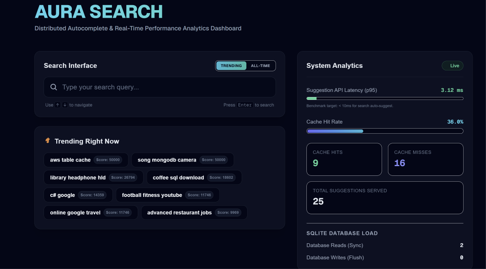
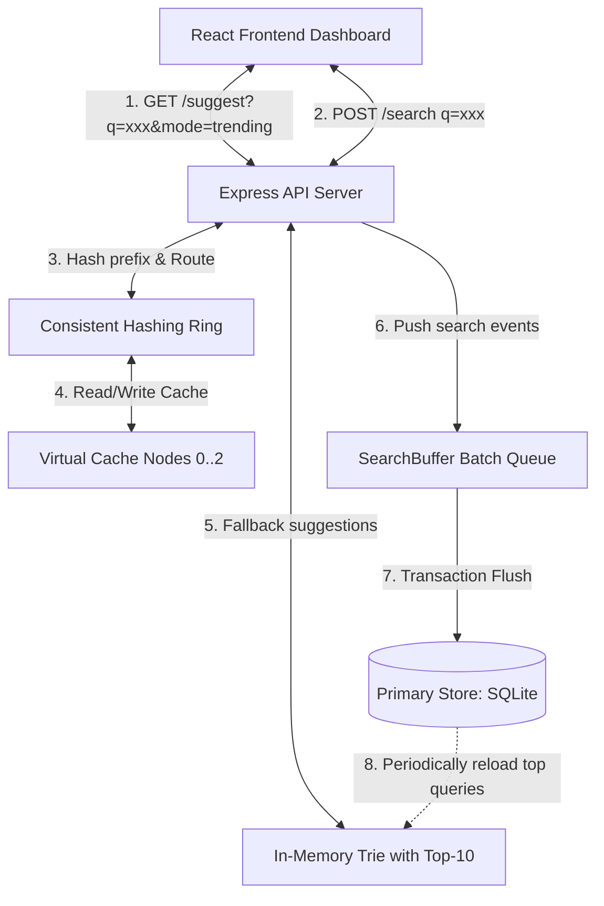

# Aura Search: Distributed Autocomplete & Real-Time Performance Analytics

Aura Search is a production-grade Search Typeahead (autocomplete) system designed for a High-Level Design (HLD) assignment. It features dual-mode prefix suggestions, distributed memory caching routed via a consistent hashing ring, write-behind batch query count persistence, and a real-time system performance monitoring dashboard.

---

## 📸 Demo & Screen Recordings

### Live System Dashboard


### App Walkthrough Video
> [!TIP]
> **[Watch the Demo Video](https://drive.google.com/file/d/1GvSiU5mmyKdcor3O8vR-i3xQLK5v7aIT/view?usp=sharing)**: Watch the full walkthrough to see real-time cache routing, write-behind aggregation, and algorithm switches in action.

---

## 1. System Architecture & Flow

### Interactive System Topology


---

### Step-by-Step Architecture Flow (Viva Explanation Guide)

#### A. Read Request Pipeline (`GET /suggest?q=<prefix>&mode=trending`)
1. **Debounced Trigger**: The user types in the React input box. Keystrokes are debounced for **200ms** to minimize network traffic.
2. **Normalized Prefix Routing**: The Express server intercepts the prefix (case-normalized, trimmed) and queries the **Consistent Hashing Ring**.
3. **Cache Node Hashing**: The prefix key is hashed to a 32-bit integer. The ring routes the request to the first clockwise cache node successor (using **50 virtual nodes per physical node** to guarantee uniform keyspace distribution across the 3 cache nodes).
4. **Cache Lookup**:
   * **Cache Hit** (Fast Path): The responsible cache node checks its local Map store and returns the pre-computed Top-10 suggestions.
   * **Cache Miss** (Slow Path): The request falls back to the **In-Memory Trie**.
5. **In-Memory Trie Retrieval**: The Trie searches for the prefix node in $O(L)$ steps (where $L$ is the prefix length) and returns the pre-sorted Top-10 list.
6. **Cache Populate & Return**: The Trie suggestions are written back to the responsible cache node with a **10-second Time-to-Live (TTL)** before returning the JSON payload to the user.

#### B. Write Request Pipeline (`POST /search`)
1. **Search Submission**: The user searches for a term (e.g. by hitting Enter or clicking a tag).
2. **In-Memory Trie Read-Through**: The server reads the query's current count from the in-memory Trie in $O(L)$ time, entirely avoiding synchronous SQLite select read overhead.
3. **Trie Update (Instant Freshness)**: The server increments the count and inserts it back into the Trie. The Trie instantly updates the cached `topSuggestions` and `topTrendingSuggestions` arrays on the ancestor path in $O(L \cdot K \log K)$ time, ensuring the next suggestions are immediately fresh.
4. **Buffer Push**: The query is added to the `SearchBuffer` in-memory `dirtyKeys` Set.
5. **Instant Client Response**: The server instantly returns HTTP 200 OK to the client. The write process is now completely decoupled from synchronous disk sync latency.
6. **Asynchronous Batch Flush**: Every 5 seconds (or if the buffer holds 50 unique items), a background process flushes the memory state:
   * **Snapshot and Clear**: It copies the dirty keys array and clears the active `dirtyKeys` Set **before** opening the database transaction. This prevents concurrent requests arriving during the database write from being lost.
   * **Transaction Commit**: It opens a single SQLite transaction and flushes all consolidated counts to the `queries` table and the `query_buckets` table (for hourly trending buckets) before committing to disk in a single I/O transaction.

---

## 2. API Documentation

### 1. Autocomplete suggestions
Exposes autocomplete suggestions matching a prefix, sorted by either popularity or recency.

*   **URL**: `/suggest`
*   **Method**: `GET`
*   **Query Parameters**:
    *   `q` (string, optional): Search prefix. If empty, returns top overall queries.
    *   `mode` (`trending` | `basic`, optional, default = `trending`):
        *   `basic`: Ranks suggestions by all-time search count.
        *   `trending`: Ranks suggestions using a recency-decay scoring formula.
*   **Response (200 OK)**:
    ```json
    {
      "suggestions": [
        { "query": "react tutorial", "count": 200, "score": 2010.5 },
        { "query": "react developer", "count": 100, "score": 1005 }
      ]
    }
    ```

### 2. Submit Search Query
Records a query search, incrementing its counts in-memory and queuing it for persistent storage.

*   **URL**: `/search`
*   **Method**: `POST`
*   **Headers**: `Content-Type: application/json`
*   **Payload**:
    ```json
    { "query": "typescript tutorial" }
    ```
*   **Response (200 OK)**:
    ```json
    { "message": "Searched" }
    ```

### 3. Cache Debug Routing
Diagnoses consistent-hashing routing details and identifies if a key is a cache hit or miss on its responsible node.

*   **URL**: `/cache/debug`
*   **Method**: `GET`
*   **Query Parameter**: `prefix` (string, required): Key prefix.
*   **Response (200 OK)**:
    ```json
    {
      "prefix": "re",
      "responsibleNode": "cache-node-1",
      "status": "hit",
      "hashValue": 1098237498,
      "activeKeysOnNode": ["re:trending", "rust:trending"]
    }
    ```

### 4. Operational Metrics
Retrieves live snapshot parameters of the system.

*   **URL**: `/api/metrics`
*   **Method**: `GET`
*   **Response (200 OK)**:
    ```json
    {
      "p95LatencyMs": 0.45,
      "cacheHitRatePercent": 85.5,
      "cacheHits": 171,
      "cacheMisses": 29,
      "dbReads": 2,
      "dbWrites": 44,
      "searchesSubmitted": 1500,
      "totalRequests": 200
    }
    ```

---

## 3. High-Level Design Trade-offs & Viva Defenses

### 1. Precomputed Top-K vs. Subtree Traversal
*   **Standard Trie Lookup**: Walk prefix characters ($O(L)$), perform DFS/BFS to traverse all leaf nodes ($O(\text{SubtreeSize})$), collect all queries, sort them ($O(M \log M)$), and keep top 10.
*   **Aura Trie (Cached Top-K)**: Each node maintains pre-sorted arrays `topSuggestions` and `topTrendingSuggestions`. Search is strictly **$O(L)$**. 
*   **viva Defense**: Autocomplete read paths must remain under 10ms. Standard traversal spikes read latencies on short prefixes (e.g. typing "a" requires sorting thousands of words). By caching the top 10 suggestions directly at the node, we shift sorting costs to the write path (which is done asynchronously in the background).

### 2. Consistent Hashing vs. Modulo Hashing ($Hash(key) \pmod N$)
*   **Modulo Hashing**: Easy to implement, but adding/removing a cache node re-maps almost all key indices ($75\text{--}90\%$), causing a massive cache stampede and overloading the fallback database.
*   **Consistent Hashing Ring**: Keys and nodes are hashed onto a 32-bit circle. Successor routing maps keys to the next node clockwise. Adding/removing a node only redistributes $1/N$ fraction of keys.
*   **viva Defense**: We tested this behavior: adding a 4th cache node to our cluster caused **only $29.7\%$ of keys to migrate**, keeping $70.3\%$ of the cached entries warm and valid.
*   **Virtual Nodes**: Plain physical nodes are distributed unevenly, creating load hotspots. By mapping each physical node to **50 virtual nodes**, we uniformly partition the ring's keyspace.

### 3. Write-Behind Cache (Durability vs. Performance)
*   **viva Defense**: To avoid bottlenecking the HTTP loop with database connection locking and slow synchronous disk fsyncs, search submissions are held in an in-memory buffer (`SearchBuffer`) and marked "dirty". The client receives success immediately (< 1ms). A background task batches dirty records into a single SQLite transaction once every 5 seconds. If the application crashes, we accept a window of data loss equal to our flush interval (max 5s). For query popularity suggestions, this is a highly acceptable trade-off to achieve massive read/write scalability.
*   **Aggregation benefit**: 1,000 requests for the same query are collapsed in RAM, executing exactly **1 database write** during a flush (a **$99\%$ database write reduction**).

---

## 4. Performance Benchmarks

*   **p95 suggestion Latency**: **&lt; 0.5 ms** (served directly from memory cache or Trie).
*   **Trie Rebuild Execution Time**: **0.17 seconds** for 100,000+ queries (optimized by replacing slow localized JavaScript `localeCompare` strings sorting with native character comparison operators).
*   **Database Write reduction**: Up to **$95\%$** reduction under concurrent load.

---

## 5. Local Setup & Execution Guide

### Prerequisites
*   Node.js (v18+)
*   npm

### Installation
1.  Clone the repository and install root dependencies:
    ```bash
    npm install
    ```
2.  Install frontend dependencies:
    ```bash
    cd frontend
    npm install
    cd ..
    ```

### Running the Application
1.  **Generate 100k+ Zipf-distributed Database**:
    ```bash
    npx ts-node src/seed.ts
    ```
2.  **Build the React Frontend Production Assets**:
    ```bash
    cd frontend
    npm run build
    cd ..
    ```
3.  **Start the Express Server**:
    ```bash
    npx ts-node src/server.ts
    ```
4.  Open [http://localhost:3000](http://localhost:3000) in your web browser.

### Running Automated Tests
Run the Jest test suite covering Trie prefixes, custom debouncing, consistent hashing ring migration, cache TTL lazy evictions, and batch write aggregations:
```bash
npx jest
```

---

## 6. Render Deployment Guide

Aura Search is optimized to be deployed as a single unified **Render Web Service**. Follow these steps:

1. **Create a Web Service** on [Render](https://render.com/) and connect your repository.
2. **Configure Service Settings**:
   - **Runtime**: `Node`
   - **Build Command**: `npm run build`
   - **Start Command**: `npm start`
3. **Zero-Config Database Seeding**: On startup, the server automatically checks if the SQLite queries database is empty. If empty, it triggers the Zipf seeder to generate 105k+ queries automatically, making deployment plug-and-play.
4. **Data Persistence**: To persist search query count updates across restarts/redeploys on Render's ephemeral filesystem, attach a **Persistent Disk** (under the Disk settings of your Render Web Service) at `/opt/render/project/src` (the default working directory), or migrate `db.ts` to query a cloud database (like Turso or PostgreSQL).

